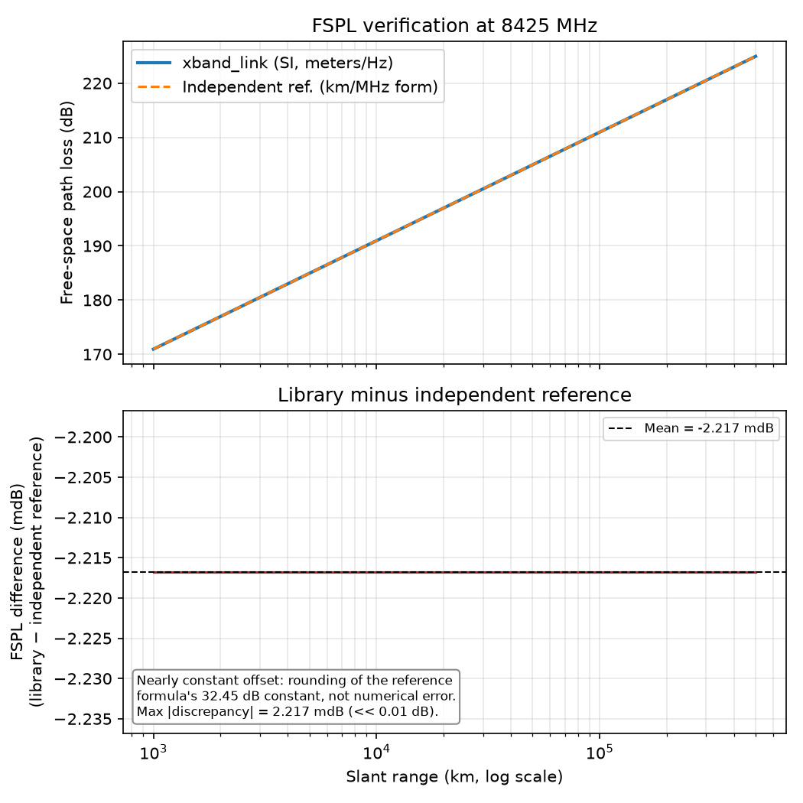
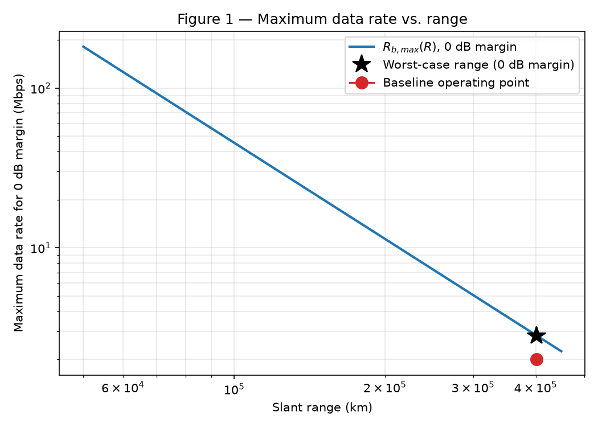
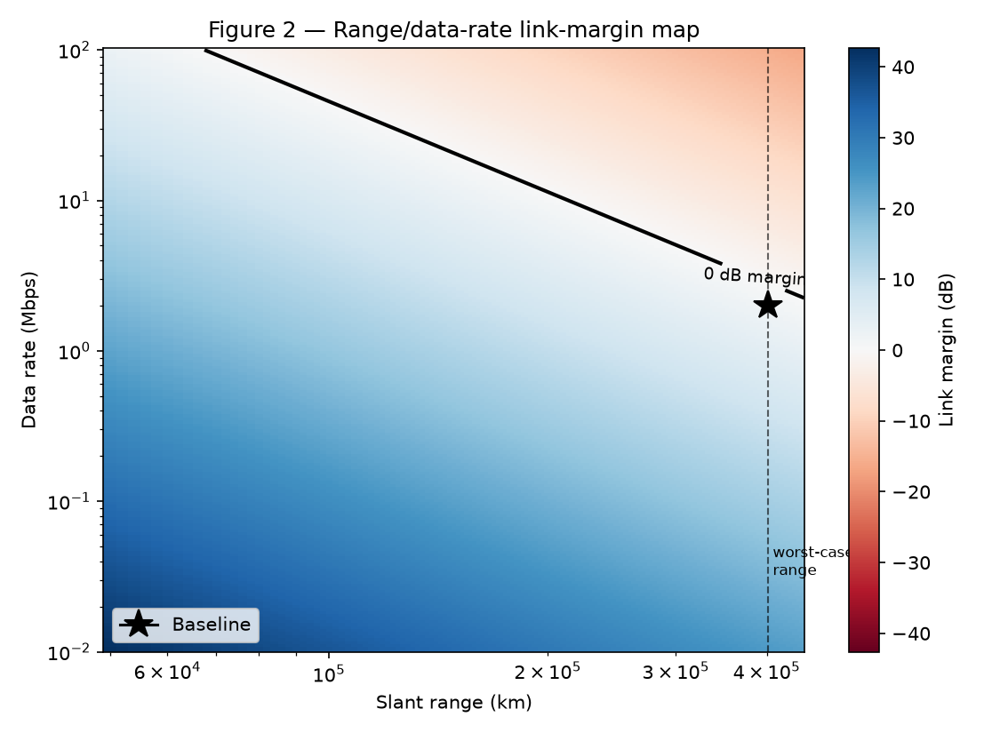
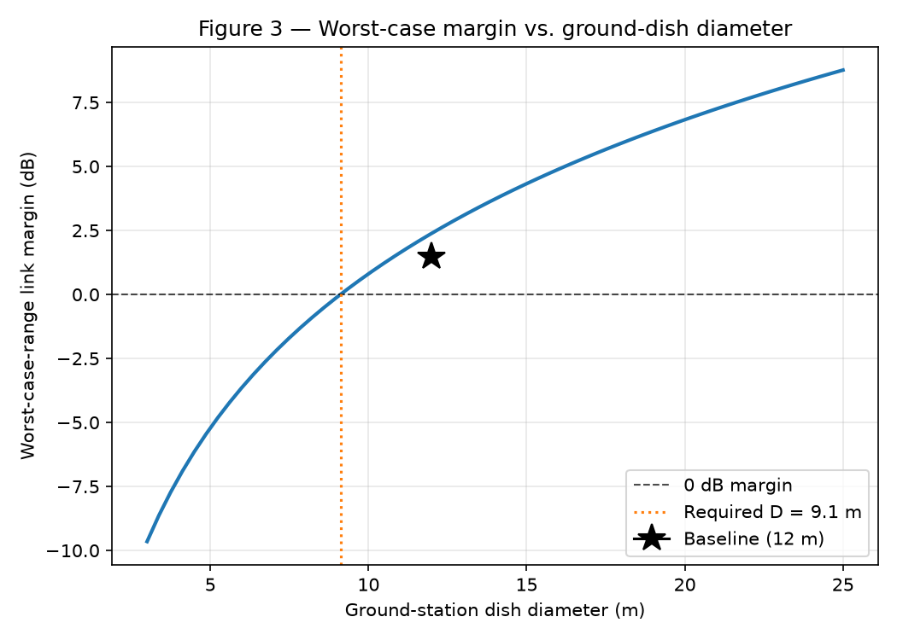
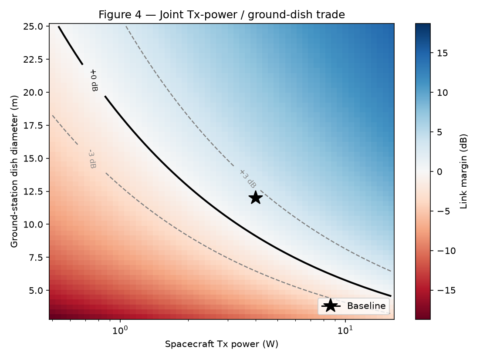
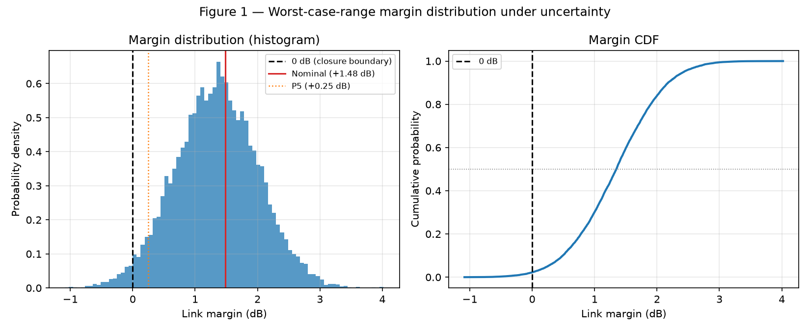
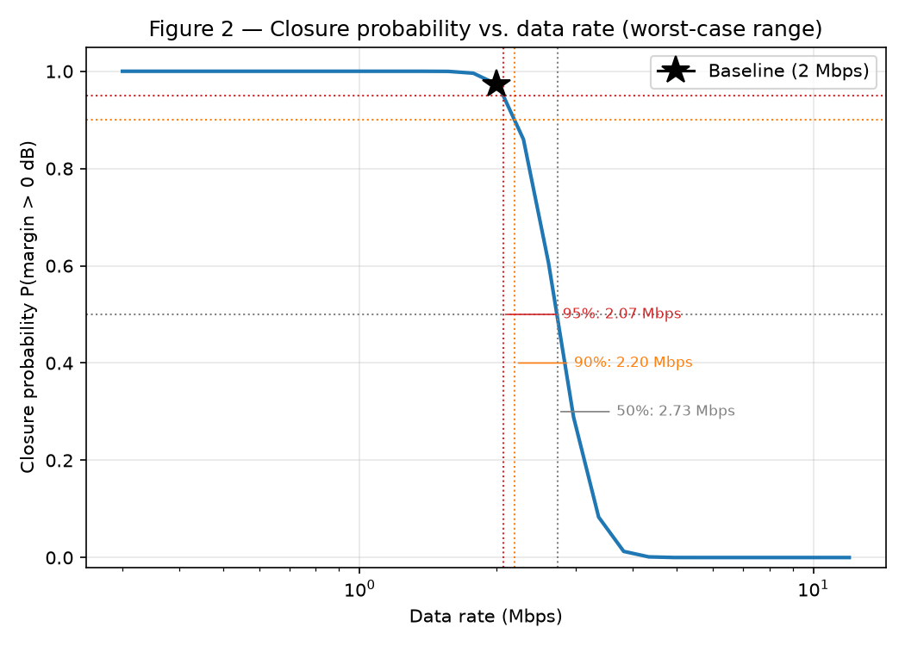
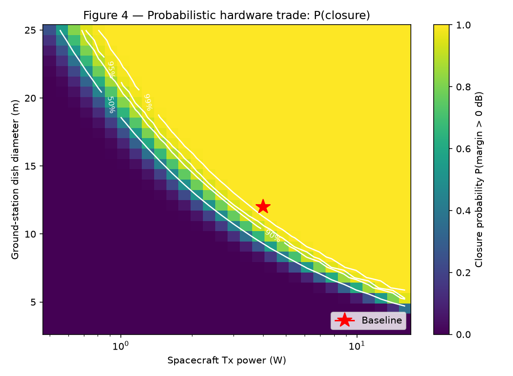

# COMMS-03 — X-band Downlink Budget

A rigorous, reproducible spacecraft X-band downlink link-budget and
margin-trade tool: deterministic link closure, range/data-rate/power/gain
trade studies, and Monte Carlo probabilistic closure analysis, all built
on one verified physics core.

> **Scope note**: this is a **representative lunar-distance X-band
> engineering study**, built to demonstrate link-budget methodology — it
> is not a real mission's link budget. It does not reflect flight-
> qualified hardware, a specific ground network's actual capability,
> regulatory frequency coordination, sourced weather/atmospheric
> statistics, or a measured modulation/coding implementation's
> performance. Every baseline parameter is labeled in
> `docs/baseline_scenario.md` as either a physical constant, a quantity
> derived from the governing equations, or a representative engineering
> assumption — none are externally sourced test data.

## Project overview

Spacecraft communications engineers routinely have to answer one
question under uncertainty: **will this downlink close, and by how
much?** This project builds that answer from first principles — free-
space propagation, thermal-noise physics, and decibel-domain link closure
— then wraps it in a reusable trade-study and uncertainty-quantification
layer, so the same verified core supports single-point link budgets,
multi-parameter design trades, and probabilistic closure-risk assessment.

## Engineering objective

**Central question:** for a representative X-band spacecraft downlink at
lunar distance, how do antenna gain, data rate, transmit power, and
worst-case range trade against link margin — and, once realistic hardware
and modeling uncertainty are included, what is the actual *probability*
the link closes?

## Baseline scenario

A small lunar-orbit spacecraft (e.g. a CubeSat/SmallSat in a highly
elliptical orbit such as a Near Rectilinear Halo Orbit) downlinking
science/telemetry data at X-band to a single non-DSN-class ground station,
evaluated at **worst-case (maximum) range**. Full parameter-by-parameter
rationale: [`docs/baseline_scenario.md`](docs/baseline_scenario.md).

| Parameter | Value | Classification |
|---|---:|---|
| Carrier frequency | 8.425 GHz | Derived (center of the 8400-8450 MHz deep-space downlink allocation) |
| Worst-case slant range | 402,000 km | Representative assumption (lunar NRHO-class apogee) |
| Tx power | 4.0 W | Representative assumption |
| Tx antenna gain | 22.0 dBi | Representative assumption |
| Tx line / pointing loss | 1.0 / 0.5 dB | Representative assumption |
| Atmospheric + other loss | 0.5 + 0.3 dB | Representative assumption |
| Rx (ground) antenna gain | 57.0 dBi | Representative assumption (~12 m illustrative aperture — see note below) |
| Rx line / pointing loss | 0.3 / 0.2 dB | Representative assumption |
| System noise temperature | 60 K | Representative assumption |
| Data rate | 2.00 Mbps | Representative assumption |
| Required Eb/N0 | 4.5 dB | Representative assumption (rate-1/2 coded BPSK/QPSK class) |
| Implementation loss | 1.0 dB | Representative assumption |
| Boltzmann constant, speed of light | — | Physical constants (CODATA/SI exact) |

> **On the 57.0 dBi receive-gain figure**: this is the link-budget's direct
> gain *input*, a round number illustratively consistent with a ~12 m
> ground antenna. It is **not** computed from the parabolic-dish aperture-
> gain helper (`xband_link.antennas.parabolic_dish_gain_dbi`, added in
> Milestone 2) — evaluated precisely for D = 12 m, f = 8.425 GHz, η = 0.55,
> that helper gives 57.9 dBi. All three numbers (57.0 dBi input, ~12 m
> illustrative dish, 57.9 dBi precise helper output) are individually
> correct in their own context; full reconciliation in
> `docs/baseline_scenario.md`.

## Governing equations

```
EIRP [dBW]        = Pt [dBW] − Lt,line − Lt,point + Gt [dBi]
Free-space loss    L_fs [dB] = 20·log10(4πRf/c)
Received power     Pr [dBW] = EIRP − L_fs − L_atm − L_other + Gr [dBi] − Lr,line − Lr,point
Noise floor         N0 [dBW/Hz] = 10·log10(k_B) + 10·log10(T_sys)
Carrier-to-noise    C/N0 [dB-Hz] = Pr − N0
Energy-per-bit      Eb/N0 [dB] = C/N0 − 10·log10(Rb)
Link margin         M [dB] = Eb/N0 − (Eb/N0)_req − L_impl
```

`R` = slant range [m], `f` = carrier frequency [Hz], `Rb` = data rate
[bit/s], `T_sys` = system noise temperature [K]. Full derivation and unit
conventions: [`docs/link_budget_equations.md`](docs/link_budget_equations.md).

## Verification

Every equation is checked against an **independently-derived
formulation** (different unit system or constant derivation), not just
re-tested against itself — free-space loss (SI meters/Hz form vs. the
classic km/MHz closed form) and the thermal noise floor (`k_B·T_sys` vs.
the "−228.6 dBW/Hz/K" reference figure) both agree to well under 0.01 dB.
Full strategy: [`docs/verification.md`](docs/verification.md).



*Figure — free-space path loss computed two independent ways agrees to
floating-point precision (residual ~10⁻¹¹ mdB) across 1,000-500,000 km.*

## Deterministic trades

**Central question:** how do range, data rate, Tx power, and antenna gain
trade against link margin at worst-case range? Methodology and inverse-
design equations: [`docs/trade_study.md`](docs/trade_study.md); reproduce
with `python scripts/run_trade_study.py`.

| Trade | Result |
|---|---|
| Doubling range | margin drops exactly **6.02 dB** (`20·log10(2)`) |
| Doubling data rate | margin drops exactly **3.01 dB** (`10·log10(2)`) |
| Max data rate at worst-case range, 0 dB margin | **2.81 Mbps** (scales ∝ R⁻²) |
| Required Tx power, 0 dB / +3 dB margin | **2.84 W** / 5.67 W |
| Required ground-dish diameter, 0 dB / +3 dB margin | **9.11 m** / 12.87 m |

| | |
|---|---|
|  Max data rate vs. range (R⁻² scaling) |  Range/data-rate margin map, zero-margin boundary |
|  Worst-case margin vs. ground-dish diameter |  Joint Tx-power / ground-dish trade |

The zero-margin contour in the second figure is the feasible-design
boundary; the fourth answers "how much spacecraft power trades against
ground aperture for the same margin?" — e.g. at the baseline's 4 W, ~12 m
of dish sits near +1.5 dB margin, while a much smaller ground station
demands substantially more spacecraft RF power. All four figures are
**deterministic**: one nominal parameter set, one margin number.

## Probabilistic closure

**Central question:** given realistic uncertainty in power, gains,
pointing, receiver noise temperature, losses, and required Eb/N0, what is
the *distribution* of margin, and what's the actual probability the link
closes? Methodology, distributions, and Monte Carlo verification:
[`docs/uncertainty_analysis.md`](docs/uncertainty_analysis.md); reproduce
with `python scripts/run_uncertainty_study.py` (master seed 42, <1 s
runtime, N=10,000 baseline samples).

**This is the project's central systems-engineering distinction — do not
conflate the two:**

| | Deterministic (single nominal point) | Probabilistic (representative uncertainty model, N=10,000) |
|---|---:|---:|
| Margin | **+1.484 dB** (one number) | mean **+1.341 dB**, σ = **0.664 dB** (a distribution) |
| "Does it close?" | Yes — margin > 0 | **P(close) = 97.8%** (95% CI: 97.5-98.1%) — not 100% |

A positive nominal margin is not the same as a robust design: the
baseline's +1.48 dB clears the empirical 95%-closure requirement
(+1.26 dB) but falls short of 99% (+1.71 dB) — exactly consistent with its
measured 97.8% closure probability sitting between those two reference
levels. Linearized (analytical) and Monte Carlo margin σ agree to 0.5%,
cross-validating the uncertainty propagation.

| | |
|---|---|
|  Margin distribution (histogram + CDF) |  Closure probability vs. data rate |
|  Probabilistic hardware trade: P(close) contours vs. the deterministic zero-margin boundary | |

Four uncertainty sources (Tx gain, Rx gain, misc. loss, required Eb/N0)
are **tied** at ~20% of margin variance each (see
[`results/fig3_sensitivity_contribution.png`](results/fig3_sensitivity_contribution.png))
— no single source dominates, so tightening any one calibration
uncertainty buys little; more hardware capability (power or aperture —
note the probabilistic trade's contour band straddling the deterministic
zero-margin boundary above) is the more effective lever. Uncertainties
are **illustrative engineering assumptions**, sampled independently (no
correlation modeled); pointing loss uses a non-negative model since
mispointing cannot reduce loss below nominal; `T_sys` remains strictly
positive; required Eb/N0 uncertainty stands in abstractly for coding/
modem implementation uncertainty. No weather/atmospheric fade
distribution is included — this is not a mission availability model.

## Key engineering findings

| Metric | Final result |
|---|---|
| Worst-case range | 402,000 km |
| Baseline data rate | 2.00 Mbps |
| **Nominal margin** | **+1.48 dB** |
| Max data rate at 0 dB margin (deterministic) | 2.81 Mbps |
| Tx power for 0 dB margin | 2.84 W |
| Ground dish diameter for 0 dB margin | 9.11 m |
| **Baseline P(close)** | **~97.8%** |
| Data rate for ~95% closure | ~2.08 Mbps |
| Range for ~95% closure (at 2.00 Mbps) | ~412,400 km |
| Nominal margin required for ~95% closure | ~+1.26 dB |
| Nominal margin required for ~99% closure | ~+1.71 dB |

**Tradeoffs, not one "best" design:**
- Spacecraft RF power trades directly against ground-station aperture for
  equivalent margin (the joint hardware-trade contour) — there is no
  universally optimal split, only a cost/schedule/risk-dependent one.
- Every doubling of data rate costs 3 dB of margin; every doubling of
  range costs 6 dB — max supportable data rate falls off as roughly R⁻².
- A positive nominal margin does not imply high closure probability by
  itself — check the probability, not just the sign of the margin.
- With variance spread roughly evenly across several uncertainty sources,
  design margin and hardware capability are usually a more effective
  robustness lever than chasing down any single calibration uncertainty.

## Repository structure

```
comms-xband-link-budget/
├── src/xband_link/
│   ├── constants.py, conversions.py     # physical constants, dB-domain conversions
│   ├── propagation.py, noise.py         # free-space loss, thermal noise, G/T
│   ├── link_budget.py                   # link closure + closed-form inverse-design helpers
│   ├── antennas.py                      # parabolic-dish aperture-gain model
│   ├── trades.py                        # deterministic trade-study sweeps
│   ├── uncertainty.py                   # parametric uncertainty model
│   └── monte_carlo.py                   # Monte Carlo engine, closure probability
├── tests/                 # 121 tests — every module independently verified
├── scripts/                # one reproducible entry point per milestone (below)
├── docs/                   # equations, baseline rationale, verification, trade &
│                            # uncertainty methodology, final summary
└── results/                # tracked tables and figures (all regeneratable)
```

## Reproducibility

```bash
python3 -m venv .venv
source .venv/bin/activate
pip install -e ".[dev]"

python -m pytest -q                     # 121 tests
python scripts/run_baseline.py          # M1: baseline link-budget table
python scripts/verify_link_budget.py    # M1: independent verification + figure
python scripts/run_trade_study.py       # M2: deterministic trade study + 4 figures
python scripts/run_uncertainty_study.py # M3: Monte Carlo uncertainty study + 5 figures
```

Every script is deterministic and reproduces the exact numbers in this
README (Monte Carlo results use a fixed, documented master seed). Tested
via a from-scratch virtual environment as part of the Milestone 4 audit.

## Limitations

Not modeled (explicit scope boundary, candidates for future work):
rain/atmospheric fade or elevation-dependent slant loss (only a fixed
scalar loss *estimate*, with its own uncertainty, is used); weather
availability statistics; ground-station pass geometry, contact-time
modeling, or lunar occultation; modulation/coding-family BER/FER curves
(required Eb/N0 is a single scalar with its own uncertainty, not a
coding-specific curve); Doppler; link-layer retransmission; hardware
reliability/failure-rate modeling; correlated uncertainty sources; range
uncertainty (range is a controlled sweep variable throughout, not a
sampled input).

## Project status

**Complete — Milestones 1-4.** Deterministic link-budget foundation,
range/data-rate/power/gain trade study, Monte Carlo probabilistic closure
analysis, and final portfolio integration are all done, tested (121/121),
and reproducible from a clean environment. See
[`docs/final_summary.md`](docs/final_summary.md) for a compact technical
summary, or the milestone-specific docs above for full depth.

## Testing

```bash
python -m pytest -q
```

121 tests: dB-domain conversion round-trips and fixed points; free-space
path loss (independent-formula cross-check, scaling-law invariants,
slant-range geometry); thermal noise (classic reference figures, G/T);
full link-budget closure (independent hand-calculation cross-check,
monotonicity/sensitivity invariants, closed-form data-rate inversion
round-trip); the parabolic-dish aperture-gain model; trade-sweep
dimensions, range/data-rate/R⁻² scaling laws, hardware trades, forward/
inverse closure round-trips for every inverse-design helper, and
analytical-vs-finite-difference sensitivity checks; uncertainty-
distribution validation, deterministic-seed reproducibility, exact Monte-
Carlo/deterministic-compute equivalence, analytical-vs-Monte-Carlo
variance agreement, closure-probability monotonicity, Wilson confidence-
interval correctness, and required-margin/variance-share consistency.

## License

MIT — see [`LICENSE`](LICENSE).
