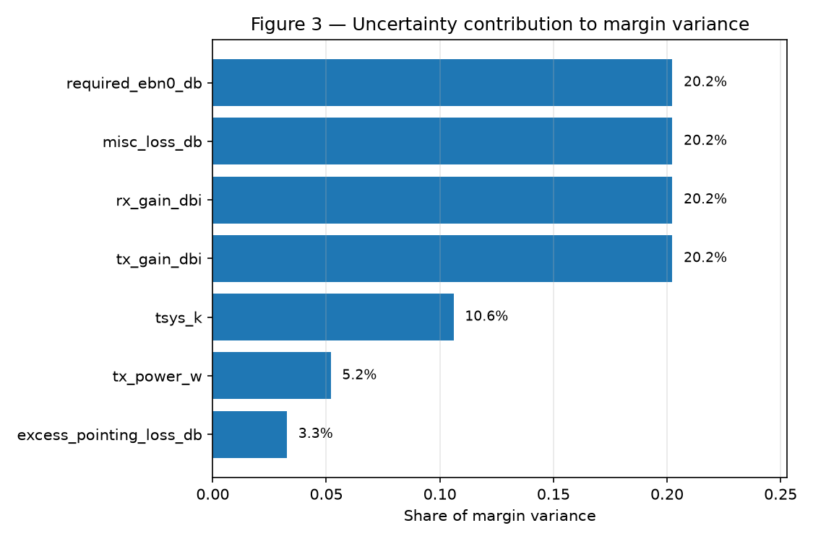

# COMMS-03 — X-band Downlink Budget

A rigorous, reproducible spacecraft X-band downlink link-budget tool.

**Central engineering question:** For a representative X-band spacecraft
downlink, how do antenna gain, data rate, transmit power, and worst-case
range trade against required link margin?

This is a portfolio-quality aerospace communications-systems project, built
milestone-by-milestone, demonstrating RF link-budget fundamentals,
free-space propagation, decibel-domain calculation discipline, thermal-
noise modeling, C/N0 / Eb/N0 / margin calculation, range/data-rate/gain
trade studies, sensitivity analysis, independent verification, and clean,
tested Python architecture.

## Status

- [x] **Milestone 1 — Link-Budget Foundations and Verification**: core
      equations, software architecture, baseline scenario, independent
      verification path, automated tests.
- [x] **Milestone 2 — Range, Data-Rate, Gain, and Power Trade Study**:
      reusable trade-study API, range/data-rate/power/gain/dish sweeps,
      closure maps, closed-form inverse-design helpers, analytical
      sensitivities, worst-case-range trade table, portfolio figures.
- [x] **Milestone 3 — Uncertainty, Monte Carlo Margin Statistics, and
      Closure Probability** (this commit): parametric uncertainty model,
      deterministic-RNG Monte Carlo engine, closure-probability sweeps vs.
      data rate/range, analytical-vs-MC variance verification, sensitivity
      ranking, probabilistic hardware trade, quantile design table.
- [ ] Milestone 4 — Final portfolio deliverable: link-budget table +
      worst-case-range margin analysis + trade-study plots.

## Repository layout

```
comms-xband-link-budget/
├── README.md
├── pyproject.toml
├── src/xband_link/
│   ├── constants.py      # physical constants (k_B, c, X-band allocation)
│   ├── conversions.py     # dB / dBW / dBm / dB-Hz conversion helpers
│   ├── propagation.py     # free-space path loss, slant-range geometry
│   ├── noise.py           # system noise temperature, N0, G/T
│   ├── link_budget.py     # end-to-end link closure + closed-form inverse-design helpers
│   ├── antennas.py        # idealized parabolic-dish aperture-gain model (Milestone 2)
│   ├── trades.py          # vectorized trade-study sweeps and joint hardware trades (Milestone 2)
│   ├── uncertainty.py     # parametric uncertainty model (Milestone 3)
│   └── monte_carlo.py     # Monte Carlo engine, closure probability, sensitivity ranking (Milestone 3)
├── tests/                 # pytest suite, each module independently verified
├── scripts/
│   ├── baseline_scenario.py   # single source of truth for the baseline mission scenario
│   ├── run_baseline.py        # computes + reports the baseline link budget
│   ├── verify_link_budget.py  # independent cross-check of the equations + figure
│   ├── run_trade_study.py     # Milestone 2 trade study: table + 4 portfolio figures
│   └── run_uncertainty_study.py  # Milestone 3 uncertainty study: table + 5 portfolio figures
├── docs/
│   ├── link_budget_equations.md  # equation reference (source of truth for the math)
│   ├── baseline_scenario.md      # parameter-by-parameter rationale for the baseline
│   ├── verification.md           # verification strategy and results
│   ├── trade_study.md            # Milestone 2 methodology, inverse equations, sensitivities
│   └── uncertainty_analysis.md   # Milestone 3 methodology, distributions, MC verification
└── results/                # generated tables and figures (tracked in git)
```

## Quickstart

```bash
python3 -m venv .venv
source .venv/bin/activate
pip install -e ".[dev]"

python -m pytest -q                     # run the test suite
python scripts/run_baseline.py          # compute + report the baseline link budget
python scripts/verify_link_budget.py    # independent verification + figure
python scripts/run_trade_study.py       # Milestone 2 trade study: table + 4 figures
python scripts/run_uncertainty_study.py # Milestone 3 uncertainty study: table + 5 figures
```

## Baseline scenario (Milestone 1)

A small lunar-orbit spacecraft (e.g. a lunar CubeSat/SmallSat in a highly
elliptical orbit) downlinking at X-band (8.425 GHz) to a ~12 m ground
station, evaluated at worst-case (maximum) range. Full parameter rationale
in [`docs/baseline_scenario.md`](docs/baseline_scenario.md); full equation
reference in [`docs/link_budget_equations.md`](docs/link_budget_equations.md).

| Quantity | Value |
|---|---:|
| Tx power (dBW) | 6.021 |
| EIRP (dBW) | 26.521 |
| Free-space path loss (dB) | 223.044 |
| Total path loss (dB) | 223.844 |
| Rx antenna gain (dBi) | 57.000 |
| G/T (dB/K) | 38.918 |
| Received power (dBW) | -140.823 |
| Noise PSD N0 (dBW/Hz) | -210.818 |
| C/N0 (dB-Hz) | 69.995 |
| Eb/N0, actual (dB) | 6.984 |
| Eb/N0, required (dB) | 4.500 |
| Implementation loss (dB) | 1.000 |
| **Link margin (dB)** | **+1.484 (closes)** |

Full table: [`results/baseline_link_budget.md`](results/baseline_link_budget.md).
Worst-case vs. best-case range comparison:
[`results/range_comparison.md`](results/range_comparison.md).

## Trade study (Milestone 2)

**Central question:** how do range, downlink data rate, spacecraft RF
power, and antenna gain trade against link margin, and what combinations
close the link at worst-case range (402,000 km)? Full methodology,
inverse-design equations, and analytical sensitivities in
[`docs/trade_study.md`](docs/trade_study.md); reproduce everything below
with `python scripts/run_trade_study.py`.

**Key findings at the baseline worst-case range:**

| Question | Answer |
|---|---|
| Baseline worst-case margin | **+1.48 dB** (2.00 Mbps) |
| Maximum data rate at worst-case range (0 dB margin) | **2.81 Mbps** |
| Effect of doubling range | margin drops **6.02 dB** (exactly `20*log10(2)`) |
| Effect of doubling data rate | margin drops **3.01 dB** (exactly `10*log10(2)`) |
| Required Tx power for 0 dB / +3 dB margin | **2.84 W** / **5.67 W** (baseline: 4.0 W) |
| Required ground-dish diameter for 0 dB / +3 dB margin | **9.11 m** / **12.87 m** (baseline: 12 m) |

Full worst-case-range design-option table (incl. two failing cases, so the
feasibility boundary is visible, not just successes):
[`results/trade_study_table.md`](results/trade_study_table.md) /
[`.csv`](results/trade_study_table.csv). Full numeric report:
[`results/trade_study_report.md`](results/trade_study_report.md).

**Portfolio figures:**

| | |
|---|---|
|  Fig. 1 — Max data rate vs. range (R⁻² scaling) |  Fig. 2 — Range/data-rate margin map, zero-margin boundary |
|  Fig. 3 — Worst-case margin vs. ground-dish diameter |  Fig. 4 — Joint Tx-power / ground-dish trade |

Figure 2's heavy black contour is the feasible-design boundary: 0 dB
margin. Figure 4 answers the systems question "how much spacecraft power
can be traded against ground-station aperture for the same margin?" —
e.g. at the baseline's 4 W, roughly a 12 m dish is needed to sit near
+1.5 dB margin; a much smaller/cheaper ground station instead demands
substantially more spacecraft RF power.

Scope note: this is a **deterministic** trade study (fixed scalar losses,
no atmospheric/coding/Doppler/pass-geometry/Monte-Carlo modeling yet) — see
`docs/trade_study.md` §13 for the explicit scope boundary and what's
planned for later milestones.

## Uncertainty & closure probability (Milestone 3)

**Central question:** given uncertainty in RF power, antenna gain,
pointing, receiver noise temperature, losses, and required Eb/N0, what is
the distribution of worst-case link margin and the probability the link
actually closes? Full methodology, distributions, and Monte Carlo
verification in [`docs/uncertainty_analysis.md`](docs/uncertainty_analysis.md);
reproduce everything below with `python scripts/run_uncertainty_study.py`
(master seed 42, runs in well under a second).

**Key findings at the baseline worst-case range (402,000 km, 2 Mbps),
N = 10,000 Monte Carlo samples:**

| Question | Answer |
|---|---|
| Nominal (deterministic) margin | +1.484 dB |
| Mean / std-dev under uncertainty | +1.341 dB / 0.664 dB |
| 5th percentile margin | +0.246 dB |
| **Closure probability P(margin > 0 dB)** | **97.8%** (95% CI: 97.5-98.1%) |
| Analytical (linearized) vs. MC sigma | 0.667 dB vs. 0.664 dB (0.5% difference) |
| Data rate for ~95% closure | 2.08 Mbps (baseline operates at 2.00 Mbps) |
| Required nominal margin for 95% / 99% closure | +1.26 dB / +1.71 dB |
| Top uncertainty contributors | Tx gain, Rx gain, misc. loss, required Eb/N0 — tied at 20.2% variance share each |

So: **+1.48 dB nominal margin is robust but not bulletproof** — it clears
the empirical 95%-closure bar but falls short of 99%, consistent with the
directly-measured 97.8% closure probability. No single uncertainty source
dominates; four parameters share the variance roughly equally, so shaving
any one calibration uncertainty further buys little — more hardware
capability (power or aperture) is the more effective lever (see the
probabilistic hardware trade, Figure 4).

**Portfolio figures:**

| | |
|---|---|
|  Fig. 1 — Margin distribution (histogram + CDF) |  Fig. 2 — Closure probability vs. data rate |
|  Fig. 3 — Uncertainty contribution to margin variance |  Fig. 4 — Probabilistic hardware trade (power vs. dish) |

Figure 5 (closure probability vs. range) and the full quantile-based
design table (baseline / weak / strengthened cases) are in
[`results/fig5_closure_probability_vs_range.png`](results/fig5_closure_probability_vs_range.png)
and [`results/uncertainty_quantile_table.md`](results/uncertainty_quantile_table.md).

Scope note: this is **parametric uncertainty and probabilistic link
closure only** — no atmospheric fade, BER curves, Doppler, or pass
geometry yet; see `docs/uncertainty_analysis.md` §17 for the explicit
scope boundary.

## Verification

Every equation is checked against an independently-derived formulation
(different unit system or constant derivation), not just re-tested against
itself. See [`docs/verification.md`](docs/verification.md) for the full
strategy and [`results/verification_report.md`](results/verification_report.md)
/ [`results/verification_fspl_vs_range.png`](results/verification_fspl_vs_range.png)
for results — free-space path loss and the thermal noise floor both agree
with independent references to well under 0.01 dB.

## Testing

```bash
python -m pytest -q
```

121 tests covering: dB-domain conversion round-trips and fixed points;
free-space path loss (independent-formula cross-check, scaling-law
invariants, slant-range geometry); thermal noise (classic reference
figures, G/T); full link-budget closure (independent hand-calculation
cross-check, monotonicity/sensitivity invariants, closed-form data-rate
inversion round-trip); the parabolic-dish aperture-gain model; (Milestone
2) trade-sweep dimensions, range/data-rate/R⁻² scaling laws, power/gain/
dish-diameter hardware trades, the joint hardware trade, forward/inverse
closure round-trips for every inverse-design helper, and analytical-vs-
finite-difference sensitivity checks; and (Milestone 3) uncertainty-
distribution validation, deterministic-seed reproducibility, exact
Monte-Carlo/deterministic-compute equivalence, analytical-vs-Monte-Carlo
variance agreement, closure-probability monotonicity vs. rate/range/power,
Wilson confidence-interval correctness, and required-margin/variance-share
consistency checks.

## License

MIT.
